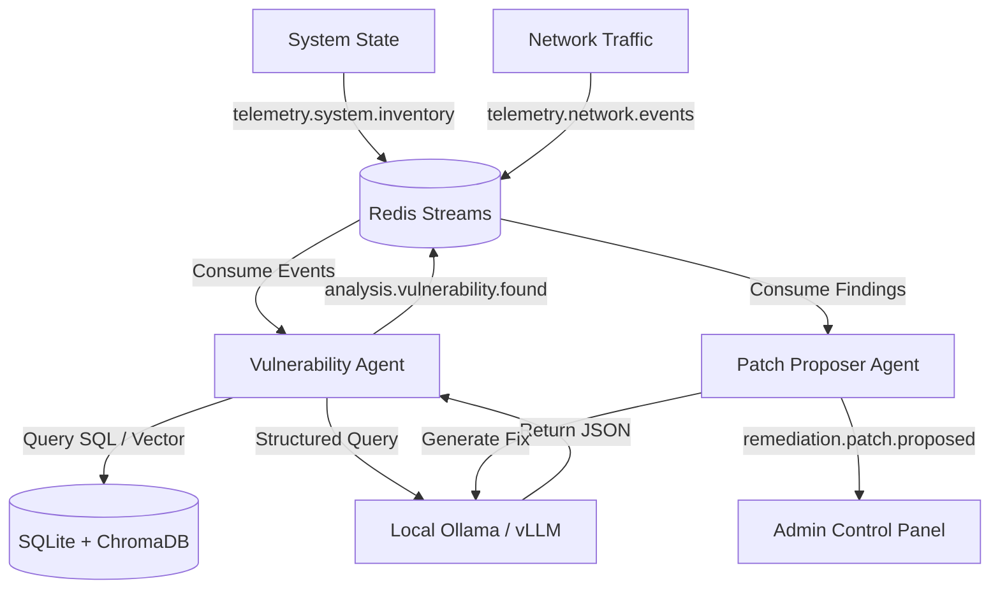

# 📦 Tracer Mesh (TM)

[](https://github.com/989tqT/tracer-mesh/actions)
[](LICENSE)
[](https://www.python.org/)
[](https://ollama.com)

**Tracer Mesh** is a 100% open-source, local-first, AI Agent  designed to scan local system configurations, analyze network traffic streams, query local CVE repositories, threat hunt vulnerabilities, and generate automated code patches.

---

## 🚀 Key Features

* **Event-Driven Broker Architecture:** Employs async Redis Streams to handle telemetry ingestion and group consumer distribution.
* **Local RAG Integration:** Cross-references SQLite records and ChromaDB vector embeddings generated locally via Ollama.
* **Structured LLM Assessments:** Prompts local LLMs (e.g., Llama-3, Mistral) to return parsed JSON vulnerability evaluations.
* **Strict Security Enforcement:** Hardens internal APIs against parameter injections using Python's keyword-only arguments.

---

## 🗺️ System Architecture



Detailed explanation of each module is documented in [docs/architecture.md](docs/architecture.md).

---

## ⚡ Quick Start

### 1. Boot up Local Redis Broker
Ensure a local Redis server is running:
```bash
docker run -d --name redis-broker -p 6379:6379 redis:alpine
```

### 2. Pull Local LLM & Embedding Models
Make sure Ollama is installed and running, then pull:
```bash
ollama pull llama3
ollama pull nomic-embed-text
```

### 3. Clone and Install Dependencies
```bash
git clone https://github.com/your-org/tracer-mesh.git
cd tracer-mesh
pip install ruff pytest pytest-asyncio redis httpx chromadb jinja2 pyyaml pydantic-settings
cp .env.example .env
```

### 4. Seed database and Execute CLI demo
```bash
# Seed SQLite and ChromaDB databases
$env:PYTHONPATH="src"; python scripts/seed_cve.py

# Launch CLI runner in mock telemetry ingestion mode
$env:PYTHONPATH="src"; python -m tracer_mesh.main --mock
```

---

## 📚 Technical Documentation

* **[Architecture Overview](docs/architecture.md):** Topology and component descriptions.
* **[User Guide](docs/user-guide.md):** Setup, configuration details, and custom rules mapping.
* **[Changelog](CHANGELOG.md):** Releases history and changes tracking.
* **[Contributing Guidelines](CONTRIBUTING.md):** Coding standards and PR instructions.
* **[Security Policy](SECURITY.md):** Guidelines for reporting security issues.

---

## 📄 License

Distributed under the Apache-2.0 License. See [LICENSE](LICENSE) for more information.
