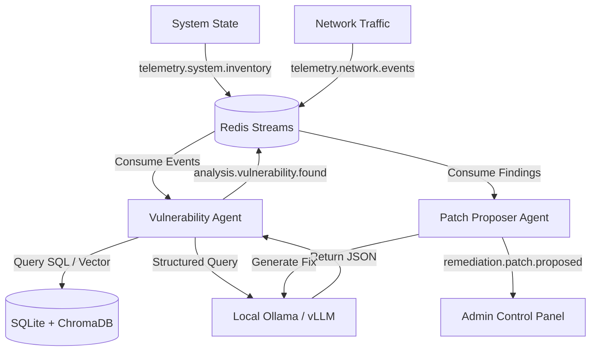

# 📦 Tracer Mesh (TM)

[](https://github.com/989tqT/tracer-mesh/actions)
[](LICENSE)
[](https://www.python.org/)
[](https://ollama.com)

**Tracer Mesh** is a 100% open-source, local-first, multi-agent AI framework designed to scan local system configurations, analyze network traffic streams, query local CVE repositories, threat hunt vulnerabilities, and generate automated code patches.

---

## 🚀 Key Features

* **Event-Driven Broker Architecture:** Employs async Redis Streams to handle telemetry ingestion and group consumer distribution.
* **Local RAG Integration:** Cross-references SQLite records and ChromaDB vector embeddings generated locally via Ollama.
* **Structured LLM Assessments:** Prompts local LLMs to return parsed JSON vulnerability evaluations.

---

## 🗺️ System Architecture



Detailed explanation of each module is documented in [docs/architecture.md](docs/architecture.md).

---

## 💻 System Requirements

* **Python:** Version 3.12+ is required.
* **Containerization:** Docker is required to spin up Redis and Ollama instances locally.
* **Hardware Profile:**
  * **Memory:** Minimum 8GB RAM. 16GB RAM is recommended if running models larger than 7B. TinyLlama can run on systems with lower specifications.

---

## ⚡ Quick Start

Follow this step-by-step workflow to configure and run the Tracer Mesh orchestrator:

### 1. Clone & Install Dependencies
Get the repository and install the dependencies:
```bash
git clone https://github.com/989tqT/tracer-mesh.git
cd tracer-mesh
pip install ruff pytest pytest-asyncio redis httpx chromadb jinja2 pyyaml pydantic-settings
```

### 2. Configure Environment Variables & Pull Models

You can run the auto-configuration script to automatically detect your system RAM, recommend the best model, pull it from Ollama, and write your `.env` file:
```bash
python scripts/setup_models.py
```

Alternatively, you can manually copy `.env.example` to `.env` and pull the models:
```bash
cp .env.example .env
docker exec -it ollama ollama pull tinyllama
docker exec -it ollama ollama pull nomic-embed-text
```

### 3. Model Recommendations Reference

Based on your system hardware, select a matching reasoning model:

| System Memory | Recommended Model | Model Size | Note |
| :--- | :--- | :--- | :--- |
| **Below 4GB RAM** | `tinyllama` | ~1.1GB | Fastest response, basic security analysis |
| **4GB to 8GB RAM** | `qwen2.5:1.5b` or `phi` | ~1.5GB - 2.5GB | Good balance between speed and quality |
| **Above 8GB RAM** | `llama3` or `mistral` | ~4.7GB - 4.1GB | Highest reasoning quality |

### 4. Spin up Docker Infrastructure
Run Redis and Ollama containers in the background, and download the models:
```bash
docker run -d --name redis -p 6379:6379 redis:alpine
docker run -d --name ollama -p 11434:11434 -v ollama_data:/root/.ollama ollama/ollama
```

### 5. Seed the CVE Database
Initialize and load vector embeddings into the SQLite and ChromaDB data stores:
```bash
mkdir -p data/cve_db/chroma
powershell -Command "Set-Item Env:PYTHONPATH src; python scripts/seed_cve.py"
```

### 6. Launch the System Orchestrator
Execute the main application running all 4 agents concurrently:
```bash
powershell -Command "Set-Item Env:PYTHONPATH src; python -m tracer_mesh.main --recon --network --patch"
```
The logging output will show each agent booting, network port polling, and stream listening cycles.

### 7. Verify with Mock Telemetry Ingestion
In a separate terminal, trigger simulated system package state updates:
```bash
powershell -Command "Set-Item Env:PYTHONPATH src; python scripts/mock_telemetry.py"
```
Immediately, you will observe the orchestrator logs indicating vulnerabilities matching database CVE definitions.

Check output streams inside Redis using the CLI utility:
```bash
docker exec -it redis redis-cli
XREAD BLOCK 5000 STREAMS analysis.vulnerability.found remediation.patch.proposed 0-0 0-0
```


## 📁 Project Structure & Development

### Directory Overview
```
tracer-mesh/
├── configs/            # Configuration files
├── data/               # SQLite and Chroma database files
├── docs/               # Technical markdown documentation
├── scripts/            # Database seeder and mock telemetry triggers
│   ├── mock_telemetry.py
│   └── seed_cve.py
├── src/                # Project source code
│   └── tracer_mesh/
│       ├── agents/     # Base, Recon, Network, Vuln, and Patch agents
│       ├── core/       # Redis broker, database client, and LLM utilities
│       ├── templates/  # Jinja prompts templates
│       └── main.py     # Main runner orchestrator
└── tests/              # Pytest test cases suite
```

### Development Guidelines

#### Run Unit Tests
Execute the full suite of unit tests:
```bash
powershell -Command "Set-Item Env:PYTHONPATH src; python -m pytest tests/"
```

#### Contribution Rules
* **Keyword-Only Parameters:** Always enforce Python keyword-only parameters (`*`) on critical functions to maintain API robustness.
* **Code Formatting:** Clean and validate changes using Ruff:
  ```bash
  ruff check src/
  ```


## 📚 Technical Documentation

* **[Architecture Overview](docs/architecture.md):** Topology and component descriptions.
* **[User Guide](docs/user-guide.md):** Setup, configuration details, and custom rules mapping.
* **[Changelog](CHANGELOG.md):** Releases history and changes tracking.
* **[Contributing Guidelines](CONTRIBUTING.md):** Coding standards and PR instructions.
* **[Security Policy](SECURITY.md):** Guidelines for reporting security issues.

---

## 📄 License

Distributed under the Apache-2.0 License. See [LICENSE](LICENSE) for more information.
