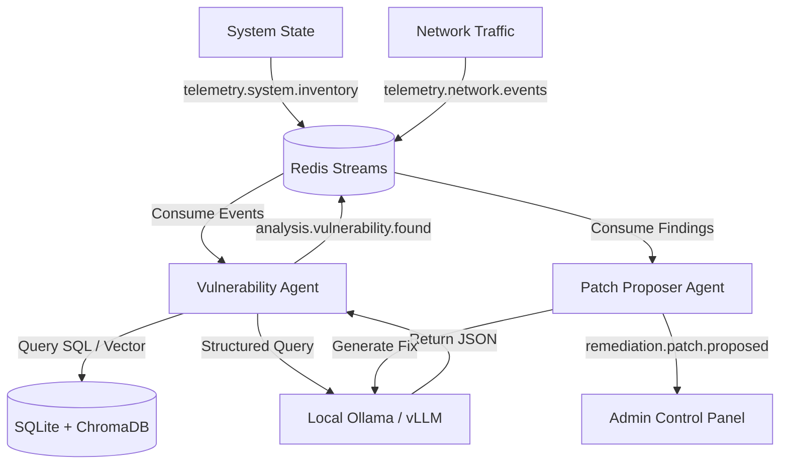

# Tracer Mesh System Architecture

This document describes the architectural layout of Tracer Mesh, a local-first, AI Agent designed for system configuration scanning, threat hunting, and automated remediation.

## System Topology

Tracer Mesh is built on an event-driven architecture using Redis Streams as the message broker, combined with a local SQLite and ChromaDB data store, and a local Ollama LLM server.

## Architectural Components

### 1. Message Broker (Redis Streams)
- **footprint:** Redis runs in a lightweight local container consuming under 50MB RAM.
- **Consumer Groups:** Establishes decoupled ingestion queues ensuring that multiple agents can subscribe to telemetry channels without duplicating processing efforts.

### 2. State Store (SQLite & ChromaDB)
- **SQLite Database:** Tracks system package indexes, ports, configuration values, and raw CVE mappings (`nvd_mirror.db`).
- **ChromaDB Vector Store:** Houses semantic vector representation of CVE descriptions to enable similarity-based lookup, avoiding hardcoded string matching.
- **Offline embeddings computation:** Employs Ollama's local embedding API rather than downloading default Chroma models online, preserving offline capabilities.

### 3. AI Agent Mesh
- **Base Agent Class:** Handles event-loop setup, async execution context, and stream listener mapping.
- **Vulnerability Analysis Agent:** Correlates telemetry feeds with local databases and prompts local LLM for context-aware security audits.
- **Patch Proposer Agent:** Takes identified vulnerabilities and outputs actionable system remediations or script overrides.
